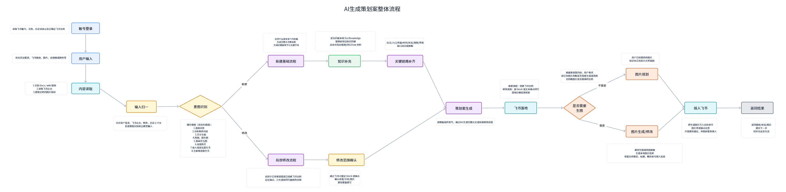
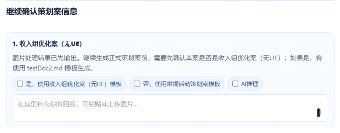
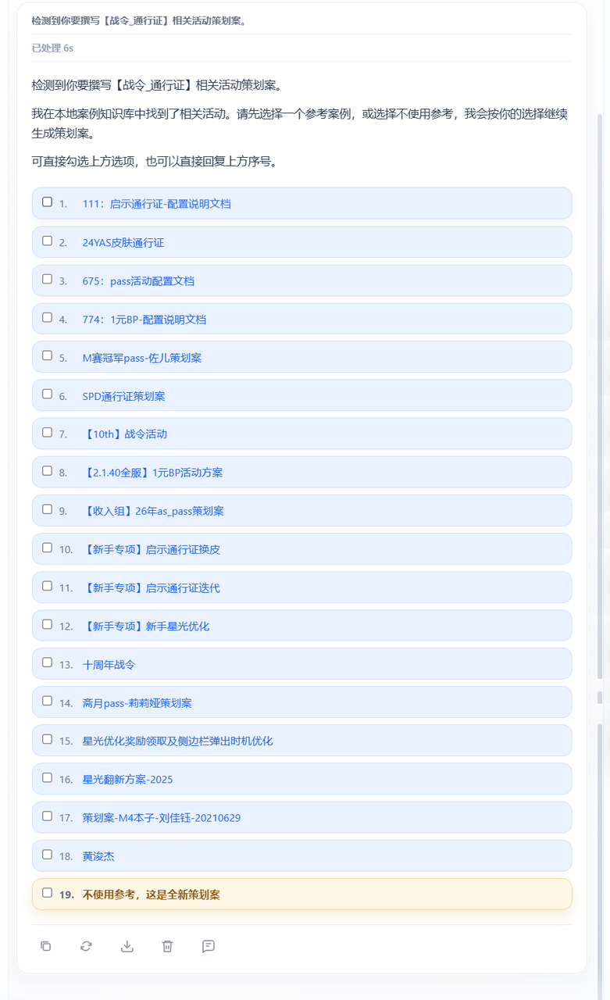
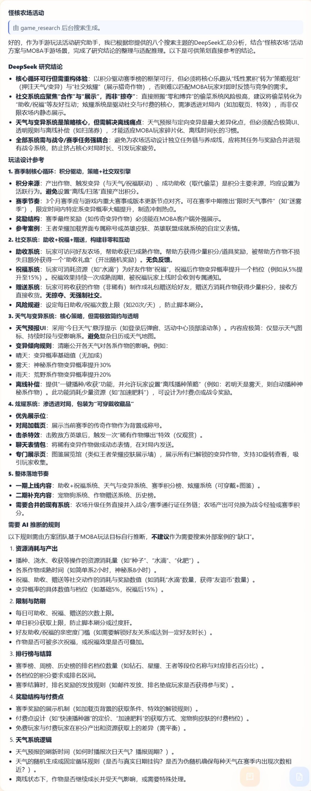
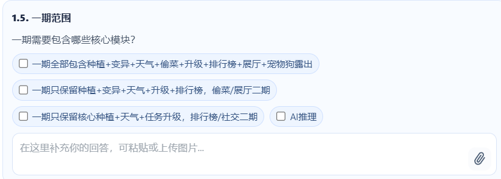
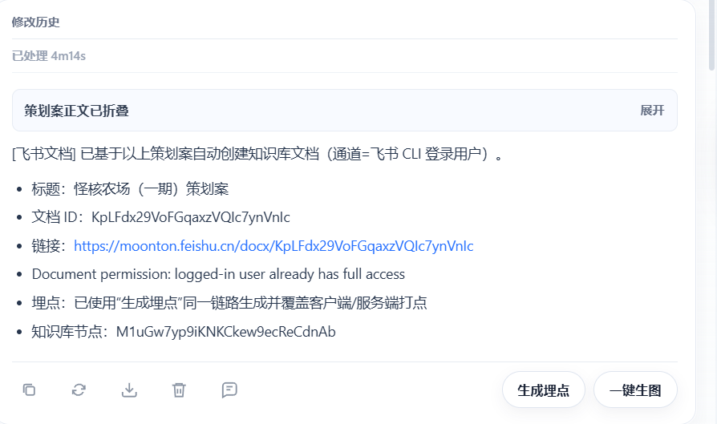
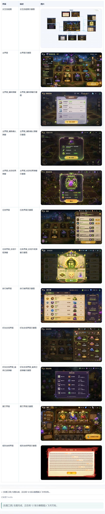
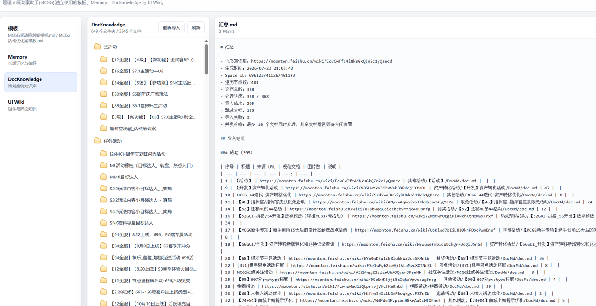
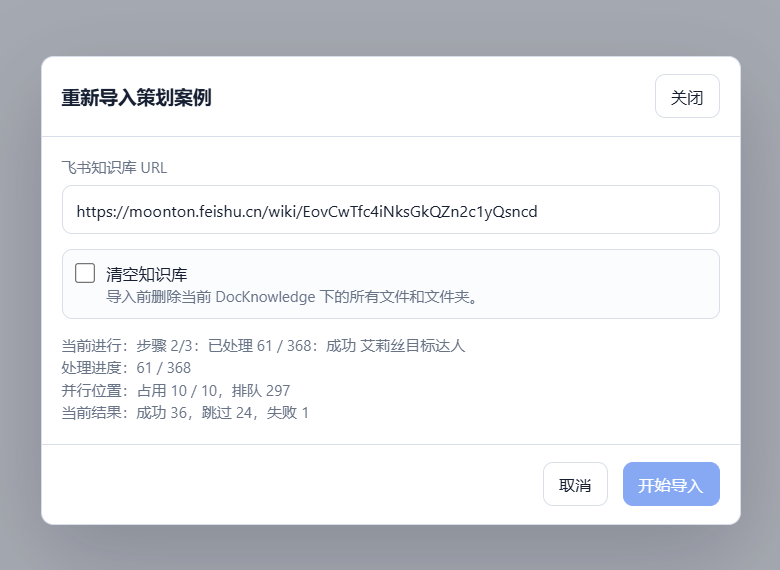
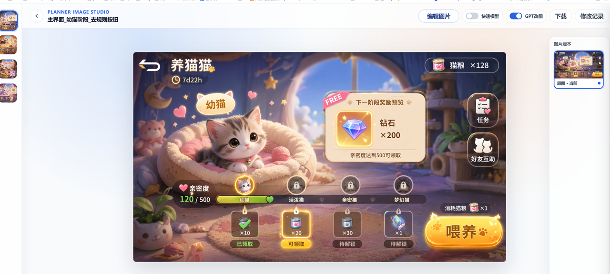

> **先从策划真实的一天开始：需求来自一句话，资料散落在旧文档、聊天记录、UE 截图和参考活动里；首版刚写完，评审又要求改规则、补界面、换图，并把所有变化同步回飞书。**

# 1. 为什么会有 AI 写策划案这个想法

产生“用 AI 写策划案”这个想法，核心原因很直接：**提高策划案生产的效率和质量**。效率上，希望减少资料查找、框架搭建、重复补全和多轮改稿的时间；质量上，希望借助统一模板、项目知识和检查机制，减少漏项、矛盾与图文不一致。它要优化的是策划的工作流程。同时统一格式后，可以提升后续的AI coding的质量。

| 核心目标     | 当前主要问题                                       | 希望 AI 带来的变化                                 |
| -------- | -------------------------------------------- | ------------------------------------------- |
| **提高效率** | 资料查找、模板套用、首版展开、固定章节补齐、飞书排版和评审修改占用大量时间        | 让 AI 承担高频重复工作，缩短从需求输入到首版策划案、再到评审修改完成的时间     |
| **提高质量** | 策划案容易出现结构不完整、规则漏项、前后矛盾、历史经验未复用，以及文字、图片和流程不同步 | 通过模板、知识库、结构化检查和图文联动，提高策划案的完整性、一致性、可评审性和可落地性 |

# 2. AI 适合解决其中哪些工作

明确“效率”和“质量”两个目标后，下一步是拆解策划案的生产过程：哪些环节必须由策划做判断，哪些环节虽然重要，却高度重复、规则明确，可以交给 AI 执行。只有把这条边界划清楚，AI 才是策划的生产工具，而不是一个替策划做决定的黑盒。

玩法取舍、商业目标、用户体验和风险判断仍然需要策划负责；但资料整理、模板套用、案例检索、缺项检查、首版展开、视觉草图和文档同步，天然适合交给 AI。于是目标从“生成一段文案”逐渐变成“承接策划案生产链中的重复执行工作”。

这也决定了系统不能只是一个聊天框。它必须理解当前要做的是问答、生文、局部改稿还是生图；必须接入模板、项目知识和历史案例；还必须能把结果写入并持续维护同一篇飞书文档。

# 3. 它具体解决哪些问题

| 痛点       | 系统怎么处理                             | 对策划的变化                |
| -------- | ---------------------------------- | --------------------- |
| 不知道从哪里开始 | 识别活动类型，选择模板，并针对会影响方案结构的信息主动追问      | 从空白页起稿变成在结构化首版上做判断    |
| 历史经验难复用  | 根据活动类型推荐旧策划案；没有本地案例时，再拆分主题进行联网调研   | 减少重复搜索，让参考资料直接进入生成上下文 |
| 规则容易漏项   | 通过模板、项目约束和知识库检查入口、玩法、奖励、结算、异常与技术需求 | 减少依赖个人记忆补齐固定章节        |
| 文字和图片分离  | 从策划章节识别界面，生成界面图和流程图，并自动写回对应章节      | 更早获得可讨论的视觉稿，保持图文对应    |
| 评审修改成本高  | 区分局部改文、全文重写、改图和图文联动，只更新受影响内容       | 修改从“重做一遍”变成“定点更新”     |
| 长会话容易失忆  | 保存项目、页签、文档和关键决策状态，并按水位压缩非关键上下文     | 多轮评审中仍能延续已确认结论        |

**能力边界：**&#x41;I负责整理、展开、检查和同步，不替代策划对玩法价值、商业目标、资源投入与最终上线方案的判断。衡量它是否有效，也不应只看“写了多少字”，而应看首版准备时间是否缩短、固定漏项是否减少、评审修改是否更快、图文是否保持一致。

有了这三个前提，下面再进入技术实现：系统如何把需求理解、生文、生图、飞书写回和长期维护串成一条链路。

# 4. 系统如何把链路串起来

## 4.1 从完整流程看系统



## 4.2 用一个真实任务看完整演示

[演示视频.mp4]()

## 4.3 哪些模块共同完成这条链路

| 功能    | 核心模块                  | 负责内容                           |
| ----- | --------------------- | ------------------------------ |
| 策划案编排 | `PlannerMasterAgent`  | 意图路由、知识装配、文本流式生成、后处理决策         |
| 飞书操作  | `PlannerFeishuMixin`  | 飞书文档创建、覆盖、Block 局部修改、读回校验、图片插入 |
| 图片生成  | `ImageAgent`          | 从文档生成、修改、提取图片                  |
| 图片编辑  | `ImageStudio`         | 目标图、蒙版、参考图、编辑指令和输出图管理          |
| 知识库管理 | `DocKnowledge`        | 活动类型识别、存储策划案、长期记忆、提示词          |
| 持久化   | `History`             | 会话、账号、标签、历史生成内容存储              |
| 联网搜索  | `WebSearch`           | 联网调研策划案idea内容，补充生成时上下文信息       |

# 5. AI 如何理解用户真正想做什么

用户不会用技术枚举描述需求。他可能说“帮我看看这版”“把奖励改掉”“按这张图重做主界面”。系统首先要把自然表达转换成明确的业务动作，否则模型能力越多，误执行的风险反而越高。

## 5.1 从用户视角归纳任务类型

系统内部提供 17 种具体执行结果，但从听众视角可以先归纳为六类任务。重点不是记住枚举值，而是理解系统如何判断“只讨论”还是“立即执行”，以及执行后是否继续生文或写回文档。

| 用户实际想做什么     | 面向用户的识别结果                   | 系统执行方式                         |
| ------------ | --------------------------- | ------------------------------ |
| 讨论想法，但暂时不执行  | 直接回答问题 / 提供建议               | 进入问答链路，不创建文档，也不触发生图            |
| 让 AI 先读懂现有资料 | 解读附件资料                      | 解析截图、附件或飞书文档，把结果作为后续任务上下文      |
| 生成新图或修改已有图片  | 根据文字生成新图片 / 基于已有图片进行修改      | 根据是否存在可编辑图片，进入生图、改图或流程图重画链路    |
| 新建、修改或重写策划案  | 创建新的完整策划案 / 修改指定内容 / 重新生成全文 | 根据当前是否已有文档，选择新建、局部修改或全文重写      |
| 先处理图片，再继续策划案 | 先改图再生文 / 图片结果同步策划内容         | 先完成图片任务，再进入策划案新建或局部修改，最后统一写回飞书 |
| 关键信息不足或与任务无关 | 先询问关键信息 / 不进入当前流程           | 阻止错误执行，先澄清目标或结束本轮任务            |

## 5.2 从业务结果转换为执行路由

此路由不是关键词 if/else，而是一次封闭枚举的结构化 JSON 判定，并决定进入哪条主执行链。

```json
{
  "route": "planner_workflow",
  "planner_mode": "partial_revision",
  "continue_planner_after_image": false,
  "confidence": 0.94,
  "clarification_required": false,
  "suggestion_request": false,
  "is_optimization_request": true,
  "image_result_should_update_planner": false,
  "reason": "用户要求修改已有策划案的奖励章节"
}
```

# 6. 普通策划案如何生成

普通生文链路解决的不是“让模型写得更长”，而是如何把模糊需求转成一份结构完整、来源明确、可以继续修改的策划案。生成前要补齐上下文，生成后还要完成飞书建档、校验和后续状态保存。

## 6.1 先固定项目规则与角色背景

包含以下四个文件，用于Prompt装配

* Template.md：主工作流描述

* Constraints.md：约束和规则

* ProjectProfile.md：项目背景和描述

* TeamProfile.md：角色介绍和定位

## 6.2 根据任务选择策划案模板

根据意图识别出的活动类型选择不同策划案模板，现在包括以下两个模板：

* 普通活动 → 常规策划案模板

* 活动优化案 → 活动优化案专属模板，识别为优化案后需要主动确认



## 6.3 让历史案例真正参与生成

根据意图识别出的近似的老活动案给策划选择，选中后作为高优先级进入上下文



## 6.4 没有本地案例时如何补充参考

当没有本地活动案作为参考时，会进入联网调研流程，将idea拆分成多个主题去联网搜索并完善后作为参考进入上下文




## 6.5 从澄清问题到可维护的飞书文档

* 问卷提问补充必要信息



* LLM 流式生成正文

* 生成飞书文档并赋予用户管理权限

* 调用数分mcp生成服务器打点表格和客户端打点表格

* Review正文根据组件wiki将通用组件和通用界面从正文中移动到附录




# 7. 策划案如何变成界面图

文字完整并不等于方案容易评审。生图链路把策划案里的界面章节继续拆成视觉任务，让关键页面和跳转关系在开发投入之前就能被讨论和修正。



## 7.1 从策划章节拆分生图任务

根据策划案章节识别具体界面，如果一个界面存在明显不同的视觉阶段，会拆成多张状态图

生成图片提示词，系统为每个界面提取出：

* 界面用途

* 页面布局

* 核心组件

* 按钮和文案

* 奖励或任务内容

* 当前界面状态

* 全局美术风格

* 参考图片

* 必须保留的数量和布局

## 7.2 并行生成并保持界面一致

* 通用界面会直接沿用知识库中图片，不会生成

* 系统为每张图片调用生图模型。互不依赖的界面可以并行生成，以减少总耗时。

* 如果后续图片依赖主界面，则先生成主界面，再把主界面作为参考图。

* 状态图会以一张原形图作为参考，统一生成

## 7.3 根据页面跳转生成交互流程图

所有界面生成完成后，会根据策划案中界面之间的跳转关系，生成交互流程图


# 8. 支撑链路稳定运行的能力

前面的体验要稳定成立，还依赖几项不直接出现在最终策划案里的基础能力：知识持续更新、图片可反复编辑，以及长对话中关键决策不丢失。

## 8.1 让项目经验可以持续复用



* 包括4个模块：模板、记忆、文档知识库、组件和界面知识

* 提供导入工具，可以根据飞书知识库的根url，更新文档知识库和长期记忆



## 8.2 让评审意见可以继续改图



* 支持目标图、蒙版与参考图处理

* 图片结果反向修改策划文本

* 历史改图结果记录与还原

* 会话llm改图处理

## 8.3 长对话仍能保持关键决策

**1. 源头管控**
&#x20;在进入上下文前先控量，不等到爆了再压。

* 大工具输出不直接塞进上下文，先落盘或存对象存储。

* 上下文只保留：工具名、摘要、指针、关键片段。

* 对重复读取的文件、模板、规范做引用复用。

**2. 通用四级水位线**

`< 60% Tier 0: 不处理 `

`60%-80% Tier 1: Micro Compact，规则压缩，删掉日志，工具输出 `

`80%-95% Tier 2: Memory Compact，历史会话结构化提取 `

`>= 95% Tier 3: Full Compact，完整摘要 + 重建 `

**Tier 1：Micro Compact**
&#x20;零 LLM 成本，只做规则处理：

* 截断旧工具输出。

* 替换长日志、grep、read、web fetch 结果。

**Tier 2：Memory Compact**
&#x20;不是简单摘要，而是结构化事实提取：

`## 当前目标 ## 已完成事实 ## 关键约束 ## 关键文件 ## 决策记录 ## 待办`

这一步适合用低成本模型或子 Agent 生成 session\_memory，替换中远期历史。

**Tier 3：Full Compact**
&#x20;高成本兜底，只在前两层不够时触发。

* 输入：旧摘要 + 待压缩历史。

* 输出：干净 summary。

* 内部可以允许模型先分析，但最终只保留 summary。

* 压缩后必须执行“战后重建”。

**3. 战后重建**

压缩完成后主动重新注入：

* 当前任务 plan。

* 关键文件摘要。

* 当前业务 policy 摘要。

* 最近用户请求。

* 保护区内原始上下文。

**4. 自动触发与熔断**

* 同一 session 连续压缩失败 3 次，停止自动压缩。

* 失败后返回明确状态，不允许无限重试。

**5. 策划案生成定制**

额外保护：

* 长期记忆与系统提示词。

* 模板结构摘要。

* 当前用户策划初稿。

* 用户关于输出格式的约束。

* 已识别的玩法、奖励、入口、结算、补发、音效、服务端规则等策划决策。

额外可压缩：

* 旧工具输出。

* 重复读取的模板全文。

* 旧的分析过程。

# 9. 最后：AI 可以提供方案，但不能替代策划决断

这套系统的价值，是帮助策划更快地整理信息、补齐方案、生成候选方向，并把文字、图片和评审修改持续维护在同一篇文档中。但无论内容多完整，AI 输出的本质仍然是供策划比较和评估的方案，而不是最终结论。

AI 可以提供候选方案、补充参考信息并提示潜在风险，但不能替代策划决定目标优先级、体验取舍、资源投入、商业风险和最终上线方案。最终决断及其责任必须由策划和项目团队承担；AI 的作用，是让人更早拿到足够完整的方案，把时间真正用在判断和决策上。

网站：https://10.20.106.150:8443/web/
