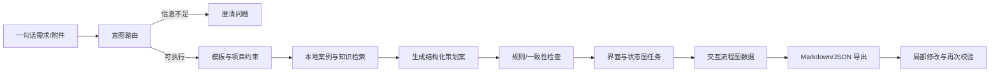

# AI 策划案管线设计大纲

## 1. 目标与边界

本项目把参考文档中的“需求理解 → 资料装配 → 策划案生成 → 规则检查 → 界面任务拆分 → 导出与持续修改”落成一个可本地运行的工作台。策划案正文使用本地 Markdown 文档库保存，第一版不依赖联网搜索或具体大模型供应商。

AI 负责整理、展开、检查和生成候选结果，策划保留玩法取舍、商业目标、资源投入、风险与最终上线方案的决策权。每个自动化结果都带有状态、来源和可追踪的决策记录。

## 2. 用户主流程

## 3. 分层架构

| 层 | 第一版职责 | 后续可替换实现 |
| --- | --- | --- |
| `domain` | 意图、策划案、知识条目、图像任务、检查结果的数据模型与枚举 | 接数据库 ORM 或对象存储元数据 |
| `pipeline` | 路由、上下文装配、生成、检查、视觉拆分、导出和状态机 | 接真实 LLM、搜索、图片模型 |
| `adapters` | `LLMProvider`、`KnowledgeStore`、`DocumentExporter`、`ImageProvider` 协议；内置确定性本地实现 | OpenAI/内部模型、向量库、ComfyUI |
| `storage` | JSON 工作流快照与本地 Markdown 文档库，包含索引和历史版本 | SQLite/PostgreSQL、对象存储 |
| `web` | 无构建依赖的本地 HTTP API 和单页工作台 | React/企业内部前端 |

核心对象是 `WorkflowRun`。它按阶段保存输入、选中的模板、检索到的参考资料、草案、检查项、视觉任务、决策记录和导出物，任何阶段失败都能从最近快照恢复。模板、项目约束和历史案例以 Markdown 文件放在 `知识库/`，生成结果以 Markdown 文件放在 `文档库/`。

## 4. 阶段与状态

1. **Intake**：接收自然语言需求，识别 `route`、`planner_mode`、置信度与澄清问题。
2. **Context**：装配项目档案、团队档案、模板、约束、历史案例和用户已确认的决策；按水位线压缩长内容。
3. **Draft**：产出结构化策划案，章节固定为目标、玩法、流程、奖励、结算、异常、埋点、技术需求和风险。
4. **Review**：执行必填项、规则一致性、奖励数值、流程终点、图文引用检查；输出错误/警告/建议。
5. **Visual**：从界面章节拆分页面和状态图任务，推导页面跳转边，保留统一视觉风格字段。
6. **Export**：将正文写入本地 Markdown 文档库，同时保存 JSON 工作流快照和版本索引。

状态只允许向前推进或回到 `draft` 进行局部修改：`intake → context_ready → drafted → reviewed → visualized → exported`。

## 5. 关键数据契约

- **意图路由**：封闭枚举 `answer`、`clarify`、`new_plan`、`partial_revision`、`full_rewrite`、`image_only`，并返回 `suggestion_request`、`continue_planner_after_image` 等控制字段。
- **策划案章节**：每章包含 `id/title/content/source_refs/status`，便于局部重写与来源追踪。
- **检查结果**：包含 `rule_id`、级别、定位章节、证据和修复建议；检查器不直接修改策划案。
- **视觉任务**：包含页面用途、布局、组件、文案、状态、参考图引用和上游任务，支持并行生成与重做。
- **上下文片段**：保留来源指针、摘要和优先级，不把大工具输出直接塞进会话；使用 60%/80%/95% 水位线进行分级压缩。

- **本地文档库**：`知识库/*.md` 作为可检索输入，`文档库/*.md` 作为策划案正文；每份输出在 `文档库/history/<document_id>/` 保存不可变版本，并由 `_index.json` 提供元数据索引。

## 6. 第一版交付范围

### 阶段 A：可运行骨架

- Python 标准库实现的领域模型、JSON 存储、本地 Markdown 文档库、HTTP API 和本地网页。
- 本地确定性生成器，让没有 API Key 的环境也能走完整流程。
- 项目规则、普通活动模板、活动优化模板和两个示例历史案例。

### 阶段 B：质量闭环

- 意图路由与澄清问题。
- 结构化草案、检查器、问题列表和决策记录。
- 局部章节修改后重新检查，导出 Markdown/JSON。

### 阶段 C：视觉与可扩展适配器

- 界面/状态图任务拆分和页面跳转图。
- `LLMProvider`、`ImageProvider`、`DocumentExporter` 的替换协议。
- 为联网搜索和真实生图服务保留连接点，不在 MVP 中绑定单一供应商。

## 7. 验证指标与迭代策略

- **完整性**：必填章节缺失率、检查器发现的固定漏项数量。
- **一致性**：玩法规则、奖励表、界面文案和流程边的冲突数量。
- **效率**：从需求到可评审草案的步骤数和耗时。
- **可维护性**：局部修改影响的章节数量、每次生成是否可追溯到输入与来源。

第一轮运行后优先迭代规则命中率、澄清问题质量、文档检索排序和局部修改范围，再接入真实模型、向量检索和生图服务。任何外部连接器都必须保持本地实现可用，避免服务不可用时阻断策划案生产。

## 8. 分阶段执行计划

1. **阶段 1（当前）**：建立目录、数据契约、模板/知识样例、确定性管线和测试。
2. **阶段 2**：补齐 HTTP API 与本地工作台，串通一键运行、检查、视觉任务和导出。
3. **阶段 3**：增加局部修改、版本快照、上下文水位压缩和外部适配器示例。
4. **阶段 4**：根据真实使用反馈调整模板、规则、本地 Markdown 检索排序和视觉拆分策略，再评估 LLM/生图接入。

## 9. 当前设计中的主动迭代

- 将“生文”和“生图”拆成独立阶段，同时保留 `continue_planner_after_image`，避免图片失败拖垮文本流程。
- 将检查结果做成只读问题清单，避免 AI 自动掩盖策划决策。
- 将外部服务全部放到适配器后面，先用确定性本地实现验证流程。
- 用版本快照承接长会话与评审修改，避免把完整历史重复注入上下文。
